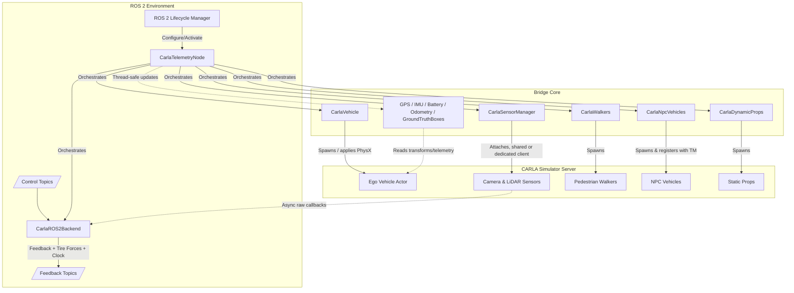
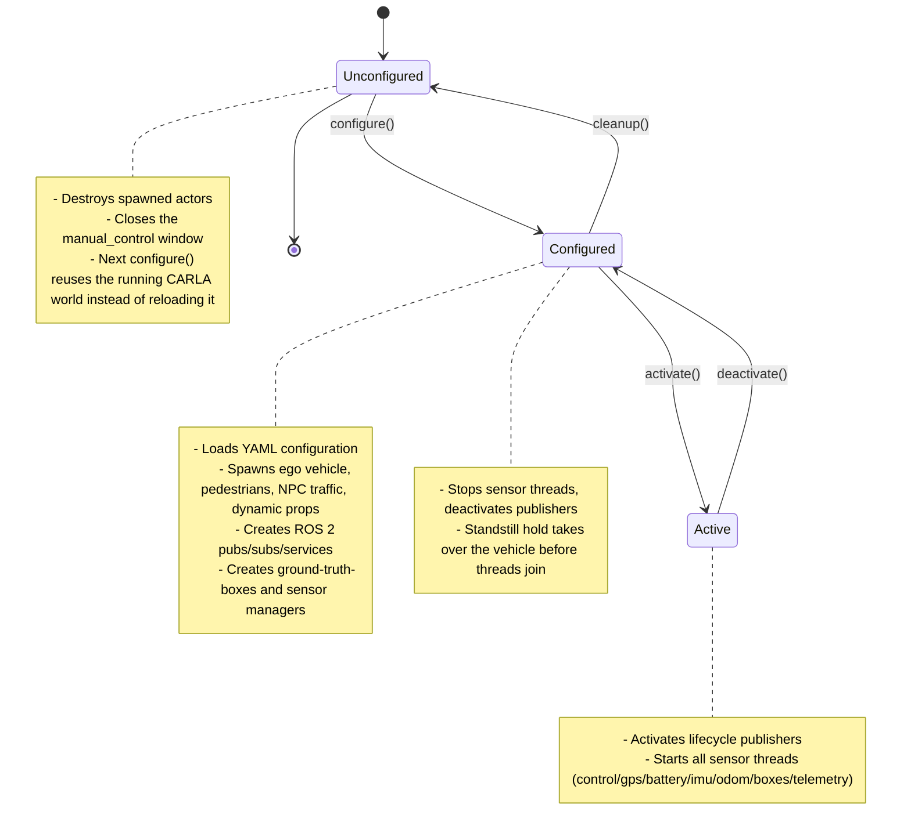

# CARLA Telemetry Interface

`carla_telemetry_cpp` is the ROS 2 bridge that drives a CARLA ego vehicle and
publishes its sensor data (cameras, LiDAR, GPS, IMU, ground-truth boxes, tire
forces, ...) over standard ROS 2 topics. It is a C++ lifecycle node built
directly against CARLA's C++ client library (`libcarla_client`), and it is
the implementation this project actually ships and runs — the sibling
`carla_telemetry` Python package still exists in the workspace, but today its
only remaining job is supplying `manual_control.py`, the pygame debugging
window the bridge can spawn as a subprocess (`carla.open_manual_control`).
Everything else described below — vehicle spawning, physics, sensors, control
— lives in this package.
## Download Carla Simulator

```bash
make download_carla_assets
```

## Running

Launch the simulator and the bridge together, then drive the lifecycle node
through its states:

```bash
make launch_carla_sim && \
ros2 lifecycle set /ASU_RT_Carla_Telemetry_Node configure && \
ros2 lifecycle set /ASU_RT_Carla_Telemetry_Node activate
```

`launch_carla_sim` starts `CarlaUE4.sh` and the bridge's launch file
together and tears both down cleanly on Ctrl-C. A few variants exist for
different hardware and workflows:

| Target | CarlaUE4 flags | Use case |
|---|---|---|
| `launch_carla_sim` | `-vulkan -prefernvidia -renderoffscreen` | Default — dedicated GPU, full render quality |
| `launch_carla_sim_low` | `-vulkan -renderoffscreen -quality-level=Low` | Lighter GPUs, or many sensors enabled at once |
| `launch_carla_sim_perf` | Same as `_low`, plus `CARLA_PERF=1` | Enables the bridge's built-in `PerfMonitor` reporting (see `perf_monitor.cpp`) |
| `launch_carla_sim_no_server` | — | CARLA server already running elsewhere; launches only the bridge |

By default the node comes up in the `unconfigured` lifecycle state and waits
for the `ros2 lifecycle set` calls above. Pass `AUTO_START=true` to the
`make` invocation to have the launch file drive `configure` → `activate`
automatically once the node is up:

```bash
make launch_carla_sim AUTO_START=true
```

## Configuration

The node is driven almost entirely by one YAML file,
`config/carla_interface_config.yaml`. Nothing below requires a rebuild to
change — edit the file and reconfigure the lifecycle node (or relaunch).

### 1. `carla`
Connection to the CARLA server and simulation stepping.
- `host`, `port`, `timeout`: connection details.
- `synchronous_mode` / `fixed_delta_seconds`: fixed-step ticking. The
  bridge's own control loop ticks the world at `1 / fixed_delta_seconds` Hz
  in sync mode; in async mode the value is unused for stepping but still
  informs the LiDAR rotation-frequency auto-derivation below.
- `open_manual_control`: spawn `manual_control.py` (pygame window) as a
  subprocess once the vehicle exists. Can be overridden per-launch with the
  `open_manual_control` launch/ROS parameter without touching the file.
- `manual_control.res` / `manual_control.render_rate`: the manual-control
  window renders its own camera on the server every tick it's asked for;
  at full size and full rate that competes with the telemetry cameras and
  LiDAR for GPU time and can push LiDAR below its configured rotation rate.
  A smaller resolution and a capped render Hz keep the monitoring view
  usable without starving the real sensor load.
- `dedicated_clients.enabled`: when `true`, every enabled camera and LiDAR
  opens its own CARLA client (its own TCP stream and `io_context`) instead of
  sharing the node's main client. This parallelizes sensor streaming across
  connections and helps individual sensors hold their configured Hz when
  many are enabled at once; when `false`, all sensors share the main client
  (lower overhead, fine for a handful of sensors).

### 2. `world`
The map and where the vehicle spawns.
- `town`: any CARLA built-in map (`Town01`…`Town07`, `Town10HD`, `Town12`,
  `Town13`, `Town15`, plus any custom map baked into the server build, e.g.
  `silverstone`). Can be overridden at runtime without touching the file by
  setting the node's `world_town` ROS 2 parameter before a reconfigure —
  useful for a scenario runner that wants to switch maps without editing
  disk state.
- `spawn_point_index`: index into `world.get_map().get_spawn_points()`; `-1`
  picks a random spawn point.
- `spawn_point_coords`: alternative to the index — an explicit
  `{x, y, z, roll, pitch, yaw}` pose. When present it takes priority over
  `spawn_point_index`.

Reconfiguring after a `cleanup` (rather than a fresh launch) reuses the
CARLA world that is already running instead of reloading the map from
scratch — the bridge only reloads the map on the very first `configure`.

### 3. `vehicle`
The ego vehicle blueprint, attributes, and physics.
- `blueprint`: CARLA blueprint filter string (partial match allowed).
- `role_name`: used as the CARLA actor role name.
- `generation`: blueprint version/generation filter (`"1"`, `"2"`, `"All"`).
- `color`: `"R,G,B"` string, or `null` for a random recommended color.
- `transmission`: `type` (`"automatic"` sets `use_gear_autobox=True`;
  `"manual"` requires driving the gear yourself), `gear_switch_time`,
  `clutch_strength`, `final_ratio`, and a `forward_gears` table
  (`ratio` / `down_ratio` / `up_ratio` per gear, empty list keeps the
  blueprint's own gears).
- `drive_mode`: `FWD`, `RWD`, or `AWD`. CARLA has no native drive-mode
  concept — the bridge emulates one by dropping the tire friction on the
  unpowered axle to a fixed low value
  (`CarlaVehicle::kNonDrivenTireFriction`), so the driven wheels do all the
  work. `AWD` leaves every wheel's configured friction untouched.
- `physics`: set `enabled: false` to skip `ApplyPhysicsControl()` entirely
  and keep the blueprint's stock physics. When enabled:
  - `mass`, `drag_coefficient`, `center_of_mass` (with
    `override_center_of_mass` to opt out of overriding the blueprint's own
    center of mass).
  - `max_rpm`, `moi` (engine moment of inertia), the three
    `damping_rate_*` factors, and `torque_curve` / `steering_curve` as
    `[[x, y], ...]` breakpoint tables.
  - `use_sweep_wheel_collision`: enables PhysX sweep-based wheel collision
    (more physically accurate, more expensive).
  - `wheels`: per-wheel (`FL`/`FR`/`RL`/`RR`, index order 0-3) overrides for
    `tire_friction`, `damping_rate`, `max_steer_angle`, `radius`,
    `max_brake_torque`, `max_handbrake_torque`.

  Getting a small vehicle to hold a low creep speed cleanly is sensitive to
  three of these in particular: an anemic torque curve stick-slips instead
  of holding a fine setpoint, zero zero-throttle damping never lets a
  coasting car decay, and tire friction above roughly 2.0 on a steered wheel
  scrubs hard enough at creep speed to stall the drivetrain intermittently.
  The shipped defaults were tuned against exactly that failure mode; treat
  large deviations from them (especially the torque curve peak and the
  wheel `tire_friction`/`damping_rate` pair) as something to re-verify with
  a low-speed hold test, not just a cornering test.

#### Available robot blueprints

| Robot name | Blueprint name |
|---|---|
| Formula Ai vehicle | `vehicle.vehicle.asurt_fsai` |

### 4. `pedestrians`
Dynamic walker pedestrians.
- `enabled`, `count`, `blueprints` (randomly distributed), `speed` (max
  walking speed, m/s).

### 5. `npc_vehicles`
Background traffic managed by CARLA's Traffic Manager.
- `enabled`, `count`, `blueprints`, `autopilot`, `tm_port`.
- Speed control — pick one: `speed_difference_pct` (percent slower/faster
  than the road's speed limit; TM-native, smooth) or `max_speed_kmh` (an
  absolute cap in km/h that overrides the percentage when greater than
  zero, at the cost of jerkier speed changes).
- `distance_to_leading_vehicle`, `auto_lane_change`.
- `hybrid_physics` / `hybrid_physics_radius`: NPCs farther than the radius
  from the ego stop running full PhysX and are dead-reckoned instead, so a
  large NPC count doesn't eat into the ego/sensor physics budget.

### 6. `dynamic_props`
Static clutter (cones, boxes, ...) scattered around the ego for perception
testing.
- `enabled`, `count`: total props to spawn.
- `max_distance`: spawn radius (m) around the world origin.
- `min_distance_from_ego`: keep-out radius around the ego vehicle.
- `prop_to_prop_distance`: minimum spacing between props, to avoid physics
  overlap on spawn.
- `spawn_on_roads`: restrict spawn points to valid road/lane locations
  rather than sidewalks or building interiors.
- `spawn_height`: vertical drop offset so props don't clip into the ground.
- `blueprints`: prop type filters, randomly distributed (wildcards allowed,
  e.g. `static.prop.box*`).

### 7. `global_coordinates`
Maps the CARLA world origin `(0, 0, 0)` to a real-world WGS-84 point
(`latitude`, `longitude`, `altitude`), used by the GPS noise model's
ENU↔WGS-84 reprojection and by ground-truth boxes/odometry when running in
GNSS-referenced mode.

### 8. `gps`
GNSS simulation and publication.
- `update_rate`, `qos_reliability`.
- `gps_xy_random_walk` / `gps_z_random_walk` / `gps_correlation_time`: a
  Gauss-Markov bias-drift model.
- `gps_xy_noise_density` / `gps_z_noise_density` /
  `gps_vxy_noise_density` / `gps_vz_noise_density`: additive white noise on
  position and velocity.
- `spawn_point`: sensor mount offset relative to the ego.
- `noise_alt_stddev` / `noise_lat_stddev` / `noise_lon_stddev`: extra noise
  applied via CARLA's own GNSS blueprint attributes, on top of the model
  above.

### 9. `battery`
A software battery model driven purely by vehicle motion — no CARLA sensor
is spawned.
- `voltage`, `open_circuit_voltage_constant_coef`,
  `open_circuit_voltage_linear_coef`: open-circuit voltage curve.
- `capacity`, `initial_charge`, `resistance`, `smooth_current_tau`:
  electrical characteristics (mirrors the Gazebo `LinearBatteryPlugin`
  model).
- `power_load`: constant baseline draw (W).
- `consumption_mode`: `"constant"` (baseline only) or `"velocity_based"`
  (baseline plus `power_per_speed` × speed).
- `start_draining`, `enable_recharge`, `charging_time` (hours, 0% → 100%).
- `update_rate`, `qos_reliability`.
- `ambient_temperature` *(optional, defaults to 25 °C)*: the model also
  runs a simple resistive-heating thermal simulation — I²R heating from the
  discharge current against Newtonian cooling toward this ambient value —
  and publishes the result in `sensor_msgs/BatteryState.temperature`.

### 10. `imu`
- `enabled`, `spawn_point`.
- `noise_accel_stddev_{x,y,z}` / `noise_gyro_stddev_{x,y,z}` /
  `noise_gyro_bias_{x,y,z}`: CARLA IMU blueprint noise attributes.
- `frame_id`, `update_rate`, `qos_reliability`.

### 11. `odometry`
Ground-truth (optionally noised) odometry, computed from the CARLA actor's
own transform and velocity — no sensor is spawned for this either.
- `enabled`, `frame_id` (parent, typically `"map"` or `"odom"`),
  `child_frame_id` (typically `"base_link"`), `update_rate`,
  `qos_reliability`, `broadcast_tf` (publish `frame_id → child_frame_id` via
  tf2 as well as the `Odometry` message).
- `mode`: `"standard"` reads the world snapshot's actor transform directly;
  `"gnss"` derives position from the ENU offset of the GPS fix relative to
  `global_coordinates`, and `gnss_use_noise` picks between the noisy
  `/feedback/gps` signal or the noise-free ground-truth GNSS reprojection.
- `follow_server_rate`: CARLA only refreshes its client-side actor-state
  cache once per server tick, so polling faster than the server re-reads
  stale data. With this `false` (the default), the odom loop detects a
  genuinely new sample by its source frame identity (not by diffing values)
  and fills the gaps between samples with bounded constant-velocity dead
  reckoning, so the topic still publishes at `update_rate` with real new
  content every message. Set it `true` to disable dead reckoning entirely —
  the topic then emits exactly one message per source sample, at that
  sample's exact stamp, and its effective rate tracks the server (or the
  GNSS stream, in `"gnss"` mode) rather than `update_rate`.
- `noise`: independent Gaussian noise on top of either mode —
  `pos_stddev_{x,y,z}` (m), `ori_stddev_{roll,pitch,yaw}` (deg),
  `vel_stddev_{x,y,z}` (m/s), `ang_vel_stddev_{x,y,z}` (deg/s), gated by
  `enabled`.

### 12. `tf`
- `broadcast_sensor_tf`: publish static `base_link → sensor` transforms
  derived from each sensor's configured `spawn_point`.
- `base_frame_id`: parent frame for those static transforms (defaults to
  `"base_link"`).

### 13. `cameras`
A list of camera actors attached to the ego. Every camera runs on its own
publish thread and, when `carla.dedicated_clients.enabled` is `true`, its
own CARLA client connection.
- `name`, `enabled`, `qos_reliability`.
- `type`: any CARLA camera blueprint — `sensor.camera.rgb`,
  `sensor.camera.depth`, `sensor.camera.semantic_segmentation`,
  `sensor.camera.instance_segmentation`, `sensor.camera.optical_flow`,
  `sensor.camera.normals`.
- `spawn_point` (`x, y, z, roll, pitch, yaw`), `image_size_x`,
  `image_size_y`, `fov`, `update_rate`, `frame_id`.
- `topic_rgb`, `topic_camera_info`: relative or absolute topics for the
  image stream and intrinsics.

### 14. `third_person_view`
A single always-behind-and-above chase camera, framed like
`manual_control`'s default view. It is built and registered exactly like a
`cameras` entry (same dedicated-client behavior), just kept in its own
config block since it serves a monitoring role rather than a perception
one.
- `enabled`, `qos_reliability`, `type`, `spawn_point`, `image_size_x`,
  `image_size_y`, `fov`, `update_rate`, `frame_id`, `topic_rgb`,
  `topic_camera_info`.

### 15. `lidars`
A list of LiDAR actors. `lidar_type` selects the underlying CARLA sensor:
- `"rotary"` → `sensor.lidar.ray_cast`. Standard spinning LiDAR; supports
  the dropoff/atmosphere noise parameters below.
- `"solid_state"` → `sensor.lidar.ray_cast_semantic`. Non-rotating,
  cone-shaped FOV (`horizontal_fov` / `vertical_fov`) with semantic labels;
  dropoff/atmosphere parameters don't apply and are ignored.
- `"gpu"` → `sensor.lidar.ray_cast_gpu`, a custom CARLA sensor.
  Same parameters and XYZI output as `"rotary"`, but rasterized on the GPU
  for real-time performance at high point counts. **Requires a CarlaUE4
  server built with this sensor** (`make CarlaUE4`) — a stock/packaged
  server will fail to find the blueprint. `use_compute: true` selects its
  GPU compute-shader sampling path.
- `"depth"` → not a CARLA LiDAR blueprint at all: a ring of
  `sensor.camera.depth` cameras (`num_cameras` around the vehicle),
  rendered entirely on the GPU with no CPU ray casting, reprojected client
  side into one `PointCloud2`. Geometry only — no intensity, no per-beam
  dropoff/atmosphere noise, since it isn't a ray-cast sensor. Works on a
  stock, unmodified CARLA server. Extra fields: `image_size_x/y`, `fov`
  (`0` auto-derives from `num_cameras` for full 360° coverage), `range`,
  `min_range`, `point_stride` (pixel decimation — `1` keeps every pixel).

Common fields: `name`, `enabled`, `qos_reliability`, `spawn_point`,
`update_rate`, `frame_id`, `topic_point_cloud`. Rotary/solid-state/GPU share
`channels`, `range`, `points_per_second`, `rotation_frequency` (`<= 0`
auto-derives the fastest of `update_rate` and the server tick rate — useful
when the exact value doesn't matter but you want it to keep up),
`upper_fov`/`lower_fov` (rotary/GPU) or `horizontal_fov`/`vertical_fov`
(solid-state), and rotary/GPU-only realistic dropoff:
`atmosphere_attenuation_rate`, `dropoff_general_rate`,
`dropoff_intensity_limit`, `dropoff_zero_intensity`.

### 16. `telemetry`
Rate for the merged feedback publish — speed, steering echo, per-wheel
joint states, tire forces, motors JSON, vehicle-state JSON, autonomous
mode. This reads the vehicle over several blocking CARLA RPCs per tick
(control state, telemetry data, four wheel-steer-angle queries); on a
loaded server each RPC can cost tens of milliseconds, so it runs on its own
dedicated thread rather than the control loop or the ROS executor.
- `update_rate`, `qos_reliability`. Lower it if the symptom is a laggy
  control tick or a saturated CARLA RPC thread rather than a need for
  faster feedback.

### 17. `ground_truth_boxes`
3D bounding boxes of every world actor — vehicles, cyclists, pedestrians,
traffic signs, and map-baked parked vehicles — read straight from CARLA
and expressed in the ego's `base_link` frame. Published as a
`visualization_msgs/MarkerArray`, frame-locked to the same world ticks the
LiDAR samples so boxes and point clouds share an identical timestamp.
- `enabled`, `frame_id` (defaults to `"base_link"`), `update_rate`,
  `qos_reliability`.
- `range_window`: an optional detection window that mimics a real sensor's
  field of view — `max_range`/`min_range` (radial XY distance, `<= 0` on
  `max_range` means unlimited), `horizontal_fov` (degrees, centered on
  ego +x; `360` disables angular gating), `z_min`/`z_max` (vertical band
  relative to `base_link`, only applied when `z_max > z_min`). The ego's
  own box is always published regardless of the window. Leave the defaults
  to publish every actor in the world.

### 18. `control`
Command source and the gains that turn a high-level command into a CARLA
`VehicleControl` (or, in Ackermann mode, into CARLA's own native
controller inputs).
- `source`: `"vehicle_interface"` (RPM + steering-angle + brake topics,
  closed-loop RPM tracking, open-loop steering) or `"ackermann_drive"`
  (a single `ackermann_msgs/AckermannDriveStamped` topic, handed straight
  to CARLA's own Ackermann controller).
- `ackermann_controller` (`ackermann_drive` only): `speed_kp/ki/kd` and
  `accel_kp/ki/kd`, pushed once to
  `Vehicle::ApplyAckermannControllerSettings`. These tune CARLA's own
  server-side cascaded speed → acceleration PID loops — the bridge itself
  runs no client-side speed or steering PID in this mode; `steer` and
  `steer_speed` are forwarded from the incoming message as-is. Both loops
  are *rate-form*: the PID output is integrated into the target
  acceleration/pedal rather than applied directly, so in practice `kd` acts
  as the effective proportional term and `kp` as the integral one —
  overshoot is governed mainly by the `speed_kd`/`speed_kp` ratio, and a
  "P-only" (near-zero `kd`) tuning on either loop reliably limit-cycles.
- `steer_vel_pid`: gains reserved for closed-loop steering-*velocity*
  tracking. In the current `vehicle_interface` control path steering is
  applied open-loop — the commanded angle is mapped straight to a
  normalized CARLA steer input and clamped to `[-1, 1]` — so this PID is
  not yet in the active control path.
- `rpm_pid`: closes the loop on drive-wheel RPM in `vehicle_interface`
  mode (`kp`, `ki`, `kd`, `max_integral`, `max_output`).
- `max_rpm`: RPM that maps to full throttle (`1.0`) in `vehicle_interface`
  mode — `throttle = |velocity_rpm| / max_rpm`, clamped to `[0, 1]`.
- `max_steer_deg`: steering angle that maps to full lock (`±1.0`) in
  `vehicle_interface` mode — `carla_steer = -steering_angle_deg /
  max_steer_deg`. Not used by `ackermann_drive`, which sends the commanded
  angle to CARLA's controller directly in radians, unclamped by this value.
- `max_velocity_kmh`: speed cap applied in **both** modes — clamps the
  commanded speed (`vehicle_interface`'s RPM target, or `ackermann_drive`'s
  commanded speed before it reaches CARLA's controller).
- `hold_brake_at_standstill` / `standstill_speed_ms` (`vehicle_interface`
  only): a proportional-only speed loop can't hold a stop by itself — at a
  zero setpoint with the vehicle already stationary the error is ~0, so it
  commands neutral (throttle 0, brake 0) and leaves the vehicle free to
  drift on any residual wheel rotation. When `hold_brake_at_standstill` is
  `true`, a zero-speed command below `standstill_speed_ms` applies full
  brake instead of coasting in neutral. `ackermann_drive` doesn't need
  this — CARLA's own controller manages its stop internally.

### 19. `ros2`
Namespaces, topic remapping, and service remapping.
- `namespace`: prepended to every *relative* topic below (e.g.
  `feedback/gps` under namespace `"sim"` becomes `/sim/feedback/gps`). A
  handful of topics are intentionally namespace-independent and always
  hardcoded absolute — `/clock`, `/sim/spawn_point`, `/sim/start`,
  `/sim/stop`, and the component-health heartbeat — because they address
  the simulation itself rather than this particular vehicle. Their literal
  `/sim/...` paths don't track `ros2.namespace`: they'd stay exactly
  `/sim/start`/`/sim/stop`/`/sim/spawn_point` even if the namespace were
  changed to something else.
- `topics`: logical name → actual topic string, for every publisher and
  subscriber documented in the ROS 2 Interface section below (feedback,
  control, and the runtime tuning topics).
- `services`: logical name → actual service string, for the battery,
  lighting, steering-mode, and manual-control-override services.

---

## ROS 2 Interface

Topic names below use `<namespace>` for whatever `ros2.namespace` resolves
to (default `sim`). A row marked *(absolute)* ignores the namespace
entirely, by design (see `ros2.namespace` above).

### Publishers

| Topic | Message Type | Description |
|-------|--------------|-------------|
| `/<namespace>/feedback/gps` | `sensor_msgs/msg/NavSatFix` | GPS fix |
| `/<namespace>/feedback/gps_vel` | `geometry_msgs/msg/TwistStamped` | GPS-derived velocity, map frame |
| `/<namespace>/feedback/battery/state` | `sensor_msgs/msg/BatteryState` | Simulated battery state, including modeled temperature |
| `/<namespace>/feedback/imu` | `sensor_msgs/msg/Imu` | IMU data, converted to the ROS REP-103 frame convention |
| `/<namespace>/odom` | `nav_msgs/msg/Odometry` | Ground-truth (optionally noised) odometry, with optional TF |
| `/<namespace>/ground_truth/boxes` | `visualization_msgs/msg/MarkerArray` | Ground-truth 3D boxes of every world actor, ego-relative |
| `/<namespace>/feedback/speed` | `std_msgs/msg/Float32` | Forward speed echo, m/s |
| `/<namespace>/feedback/steering_angle` | `std_msgs/msg/Float32` | Measured front-wheel steering angle, degrees |
| `/<namespace>/feedback/steering_angles` | `sensor_msgs/msg/JointState` | Per-wheel joint state, all 4 wheels |
| `/<namespace>/feedback/motors` | `std_msgs/msg/String` | JSON: per-wheel speed/torque/brake/error state |
| `/<namespace>/feedback/tire_forces` | `sim_manager_msgs/msg/TireForces` | Per-wheel slip, load, and force, straight from CARLA's own wheel telemetry |
| `/<namespace>/feedback/vehicle_state` | `std_msgs/msg/String` | JSON: lights, blinkers, active steering mode |
| `/<namespace>/<camera_name>/rgb` | `sensor_msgs/msg/Image` | Camera stream (RGB or the selected CARLA camera type) |
| `/<namespace>/<camera_name>/camera_info` | `sensor_msgs/msg/CameraInfo` | Camera intrinsics |
| `/<namespace>/lidar/<lidar_name>/points` | `sensor_msgs/msg/PointCloud2` | LiDAR point cloud |
| `/clock` *(absolute)* | `rosgraph_msgs/msg/Clock` | Simulation clock, sourced from the same sim-time epoch as every sensor stamp |
| `/carla_system_manager_node/component_health` *(absolute)* | `sim_manager_msgs/msg/ComponentHealth` | Heartbeat/status of the bridge node itself |

All feedback stamps — sensors, tire forces, motors/vehicle-state JSON,
joint states — are drawn from the same simulation-time epoch as `/clock`,
not the node's wall-clock ROS time. In synchronous mode CARLA ticks as fast
as the server can manage, so sim time can run at a different rate than wall
time (observed close to ~1.9× realtime on this project's reference
hardware); anything stamped with `now()` instead would drift against the
rest of the feedback without bound.

#### `feedback/motors` JSON

```json
{
  "timestamp": 123456789.0,
  "frame_id": "Motors_Data",
  "front_left": {
    "speed_rpm": 100.0,
    "speed_mps": 2.0,
    "steering_angle_deg": 10.0,
    "steering_angle_rad": 0.1745,
    "steering_angular_velocity": 0.0,
    "steering_angular_velocity_radps": 0.0,
    "brake_percentage": 0.0,
    "power": 100.0,
    "torque": 10.0,
    "drive_motor_error": "OK",
    "steering_motor_error": "OK",
    "brake_motor_error": "OK"
  },
  "front_right": { "...": "same fields" },
  "back_left":   { "...": "same fields" },
  "back_right":  { "...": "same fields" }
}
```

`brake_percentage` reflects the real CARLA brake pedal in every control
mode (sampled from `Vehicle::GetTelemetryData()`, which stays valid even
while `ackermann_drive`'s native controller is driving — unlike
`Vehicle::GetControl()`, which reads back a flat zero once the Ackermann
controller is active).

#### `feedback/vehicle_state` JSON

Published every telemetry tick. `lights` and `blinkers` are decoded from
CARLA's `VehicleLightState` bitmask. `steering.mode` is the active steering
mode name (`disable`, `front_ackerman`, `double_ackerman`, `crab_steer`,
`front_parallel`, `double_parallel`, `go_to_home`, `calibration`), and
`steering.mode_id` is the matching `carla_msgs/srv/SetSteeringMode`
integer constant. `blinkers.hazard` is `true` only when both blinkers are
on.

```json
{
  "timestamp": 123456789.0,
  "frame_id": "Vehicle_State",
  "lights": {
    "position": false, "low_beam": false, "high_beam": false,
    "brake": false, "reverse": false, "fog": false,
    "interior": false, "siren": false, "special2": false
  },
  "blinkers": { "left": false, "right": false, "hazard": false },
  "steering": { "mode": "double_ackerman", "mode_id": 2 }
}
```

#### `feedback/tire_forces`

A direct passthrough of CARLA's own per-wheel `WheelTelemetryData` — there
is no analytic tire model in the bridge, so nothing here can disagree with
the physics the vehicle is actually being driven by. Wheel order for every
array is `[FL, FR, RL, RR]`.

| Field | Meaning |
|---|---|
| `wheel_names` | `["FL", "FR", "RL", "RR"]` |
| `slip_angle` | CARLA's `lat_slip`, converted from degrees to radians |
| `slip_ratio` | CARLA's `long_slip`, dimensionless |
| `normal_load` | CARLA's `tire_load`, newtons |
| `lateral_force` | CARLA's `lat_force`, sign-flipped into the ROS body frame (+y = left). Cross-checked against measured `mass * lateral_accel` on this vehicle — a genuine contact-patch force. |
| `longitudinal_force` | CARLA's `long_force` (+x = forward). **Not** a contact-patch force — CARLA computes it as exactly `-torque / wheel_radius`, i.e. drivetrain torque at the axle. It only matches what the chassis actually feels while the tire rolls without slipping; treat it as drivetrain effort, not a physical force, especially under wheelspin. |
| `wheel_torque` | CARLA's `torque` per wheel, N·m |

`lateral_force` and `slip_angle` need the sign/unit fix above because
CARLA's client is left-handed (+y right) while ROS is right-handed
(+y left); `longitudinal_force` and `slip_ratio` need neither, since `x` is
forward in both conventions and slip ratio is a dimensionless magnitude.

### Subscribers

| Topic | Message Type | Description |
|-------|--------------|-------------|
| `/<namespace>/control/velocity_rpm` | `std_msgs/msg/Float32` | Drive-motor target RPM (`vehicle_interface` mode; positive = forward) |
| `/<namespace>/control/steering_angle_deg` | `std_msgs/msg/Float32` | Commanded steering angle, degrees (`vehicle_interface` mode; +left / -right) |
| `/<namespace>/control/brake` | `std_msgs/msg/Bool` | Emergency brake — highest priority, zeroes any pending speed command |
| `/<namespace>/control/ackermann_drive` | `ackermann_msgs/msg/AckermannDriveStamped` | Ackermann speed/steer command (`ackermann_drive` mode). The ICD binds this to the absolute topic `/drive` by default — see `ros2.topics.control_ackermann`. |
| `/<namespace>/control/tire_friction` | `std_msgs/msg/Float32` | Runtime override of tire-to-ground friction on every driven wheel, applied via `ApplyPhysicsControl` — no respawn needed. Non-driven wheels stay at the low FWD/RWD emulation value. `feedback/tire_forces` reflects the change immediately, since it reads friction from CARLA rather than from a separately configured value. |
| `/<namespace>/control/drag_coefficient` | `std_msgs/msg/Float32` | Runtime override of the vehicle's aerodynamic drag coefficient, same mechanism as above |
| `/sim/spawn_point` *(absolute)* | `geometry_msgs/msg/Pose2D` | Teleports the ego vehicle to `x, y, theta` |
| `/sim/start` *(absolute)* | `std_msgs/msg/Empty` | Resumes simulation ticking |
| `/sim/stop` *(absolute)* | `std_msgs/msg/Empty` | Pauses simulation ticking |

Both runtime-tuning topics write straight to CARLA's live
`VehiclePhysicsControl` and are **not** persisted — on restart the
`vehicle.physics` block in the YAML takes effect again.

### Services

| Service | Service Type | Description |
|---------|--------------|-------------|
| `/sim/start` *(absolute)* | `std_srvs/srv/Trigger` | Resume simulation |
| `/sim/stop` *(absolute)* | `std_srvs/srv/Trigger` | Pause simulation |
| `/<namespace>/control/battery/start_drain` | `std_srvs/srv/Trigger` | Start battery consumption |
| `/<namespace>/control/battery/stop_drain` | `std_srvs/srv/Trigger` | Stop battery consumption |
| `/<namespace>/control/battery/start_charge` | `std_srvs/srv/Trigger` | Start battery recharge |
| `/<namespace>/control/battery/stop_charge` | `std_srvs/srv/Trigger` | Stop battery recharge |
| `/<namespace>/control/lights/high_beams` | `std_srvs/srv/SetBool` | Toggle high beams |
| `/<namespace>/control/lights/low_beams` | `std_srvs/srv/SetBool` | Toggle low beams |
| `/<namespace>/control/lights/left_blinker` | `std_srvs/srv/SetBool` | Toggle left turn signal |
| `/<namespace>/control/lights/right_blinker` | `std_srvs/srv/SetBool` | Toggle right turn signal |
| `/<namespace>/control/lights/siren` | `std_srvs/srv/SetBool` | Toggle special/siren lights |
| `/<namespace>/control/lights/brake_lights` | `std_srvs/srv/SetBool` | Toggle brake lights |
| `/<namespace>/control/force_manual_control` | `std_srvs/srv/SetBool` | Override ROS 2 control and force pygame manual control |
| `/<namespace>/control/set_steering_mode` | `carla_msgs/srv/SetSteeringMode` | Switch between front/rear/four-wheel steering modes |

---

## C++ Implementation (`carla_telemetry_cpp`)

### Package layout

```
src/ros_apps/carla_telemetry_cpp/
├── CMakeLists.txt              # ament_cmake build: rclcpp, libcarla_client, yaml-cpp
├── package.xml
├── launch/carla_telemetry.launch.py
├── include/carla_telemetry/
│   ├── sensors/
│   │   ├── battery.hpp
│   │   ├── camera.hpp
│   │   ├── depth_lidar.hpp       # GPU depth-camera-ring LiDAR
│   │   ├── gps.hpp
│   │   ├── ground_truth_boxes.hpp
│   │   ├── imu.hpp
│   │   ├── lidar.hpp             # rotary / solid_state / gpu
│   │   ├── odometry.hpp
│   │   ├── sensor_client.hpp     # dedicated per-sensor CARLA client
│   │   └── sensor_clock.hpp      # sim-time <-> wall-time anchoring
│   ├── dynamic_props.hpp
│   ├── node.hpp                  # CarlaTelemetryNode lifecycle class
│   ├── npc_vehicles.hpp
│   ├── perf_monitor.hpp
│   ├── ros2_backend.hpp          # publishers, subscribers, services, control
│   ├── sensor_manager.hpp
│   ├── types.hpp
│   ├── vehicle.hpp
│   └── walkers.hpp
└── src/
    ├── sensors/                 # one .cpp per header above
    ├── main.cpp                 # entry point, MultiThreadedExecutor
    ├── node.cpp                 # lifecycle callbacks + sensor-thread loops
    ├── npc_vehicles.cpp
    ├── dynamic_props.cpp
    ├── perf_monitor.cpp
    ├── ros2_backend.cpp         # topics/services, PID loops, control application
    ├── sensor_manager.cpp
    ├── vehicle.cpp
    ├── walkers.cpp
    └── dds_profiler_node.cpp    # standalone consumer-side rate/latency tool
```

### Architecture and core modules



1. **`CarlaTelemetryNode` (lifecycle node)** — inherits
   `rclcpp_lifecycle::LifecycleNode`, owns every other module, and starts a
   fixed set of dedicated sensor threads on activation (see Threading model
   below). Nothing here runs on an `rclcpp::TimerBase` — CARLA RPCs block,
   and a blocking callback on a shared executor group risks deadlocking the
   node's own `change_state`/`get_state` services.

2. **`CarlaVehicle` (ego vehicle handler)** — connects to CARLA, resolves
   and spawns the blueprint, and applies the `vehicle.physics` overrides
   (mass, inertia, torque/steering curves, drag, per-wheel friction/damping/
   brakes). Emulates `FWD`/`RWD`/`AWD` by adjusting per-wheel friction, and
   handles automatic/manual gear shifts.

3. **`CarlaROS2Backend` (ROS 2 interface layer)** — owns every publisher,
   subscriber, and service; runs the `vehicle_interface` PID loops
   (RPM tracking); forwards `ackermann_drive` commands to CARLA's native
   Ackermann controller; and assembles the merged per-tick feedback
   (speed, steering, joint states, tire forces, motors/vehicle-state JSON)
   from a single snapshot of vehicle state rather than re-fetching it once
   per publisher.

4. **`CarlaSensorManager` / dedicated sensor clients** — spawns and
   registers cameras, LiDARs (rotary, solid-state, GPU, and the
   depth-camera-ring variant), and — when `carla.dedicated_clients.enabled`
   — opens an independent CARLA client per sensor so heavy sensor rigs don't
   serialize on one TCP connection. Streams raw sensor callbacks straight
   into `CarlaROS2Backend`'s publishers to minimize data copies.

5. **`CarlaGroundTruthBoxes`** — reads every world actor's pose and
   bounding box each tick (bounding boxes are cached per actor id, since
   fetching one is a blocking RPC and a box never changes shape), converts
   it into the ego `base_link` frame, applies the optional detection
   window, and is frame-locked to the same `World::OnTick` callback the
   LiDAR uses so boxes and point clouds share an identical timestamp.

### Threading model

The control tick and the RPC-heavy feedback reads are deliberately kept on
separate threads so a slow CARLA RPC never stalls the other:

| Thread | Rate | Responsibility |
|---|---|---|
| `control_loop` | `1 / fixed_delta_seconds` (sync mode) | Ticks the CARLA world, applies vehicle control, publishes `/clock`, pumps pedestrian navigation, publishes the component-health heartbeat |
| `telemetry_loop` | `telemetry.update_rate` | The merged vehicle feedback: speed, steering echo, joint states, motors/vehicle-state JSON, tire forces |
| `gps_loop`, `battery_loop`, `imu_loop`, `odom_loop` | each sensor's own `update_rate` | Independent per-sensor publish loops |
| `boxes_loop` | frame-locked via `World::OnTick`, decimated to `ground_truth_boxes.update_rate` | The blocking ground-truth-box RPC, off the tick thread |
| Camera / LiDAR sensor threads | each sensor's own `update_rate` | Owned by `CarlaSensorManager`; async CARLA sensor callbacks converted directly to ROS messages |

`main.cpp` spins the node on a `rclcpp::executors::MultiThreadedExecutor`,
so the lifecycle services and the backend's own subscriptions/services
(reachable from a dedicated callback group created once in the node's
constructor) never contend with each other or with the loops above.

### Lifecycle state machine



- **`on_configure`**: parses the YAML, spawns the ego vehicle (reusing the
  current CARLA world if this follows a `cleanup`, or the `world_town`
  parameter override if set), pedestrians, NPC traffic and dynamic props,
  then builds `CarlaROS2Backend` and `CarlaSensorManager`. A failure partway
  through tears down whatever was already built and reports `FAILURE`
  rather than letting an exception unwind the executor — the node stays
  `unconfigured` and can be retried cleanly.
- **`on_activate`**: activates the lifecycle publishers and starts every
  sensor thread described above.
- **`on_deactivate`**: joins every sensor/control thread *before*
  deactivating publishers, and stops the vehicle.
- **`on_cleanup`**: destroys every spawned actor and closes the manual
  control window; marks the next `configure()` to reuse the live CARLA
  world.
- **`on_shutdown`**: identical teardown to `on_cleanup`, for process exit.
  `main.cpp` additionally runs a 5-second shutdown watchdog that force-exits
  the process if teardown hangs — CARLA client teardown issues blocking
  RPCs that can stall if the server has already gone away, and an orphaned
  bridge process left holding a dedicated sensor client will keep
  reconnecting and flood the next CARLA server it finds.

### Build and run

Format and build the workspace (this also runs `clang-format` over the
package first):

```bash
make setup_ros2_workspace
```

Download the CARLA simulator assets:

```bash
make download_carla_assets
```

Run the simulation and the bridge (see the launch-target table under
"Running" above for the low-quality and profiling variants):

```bash
make launch_carla_sim                 # CARLA server + bridge together
make launch_carla_sim_no_server       # bridge only, server already running
```

To inspect what the bridge is actually delivering over DDS — received
rate and header-to-arrival latency per topic, logged every 10 seconds — run
the standalone profiler node against the same config file the bridge uses:

```bash
make run_dds_profiler
```

By default the node comes up `unconfigured`; drive it through its
lifecycle manually, or pass `AUTO_START=true` to `make launch_carla_sim` to
have the launch file configure and activate it automatically:

```bash
ros2 lifecycle set /ASU_RT_Carla_Telemetry_Node configure
ros2 lifecycle set /ASU_RT_Carla_Telemetry_Node activate
```
