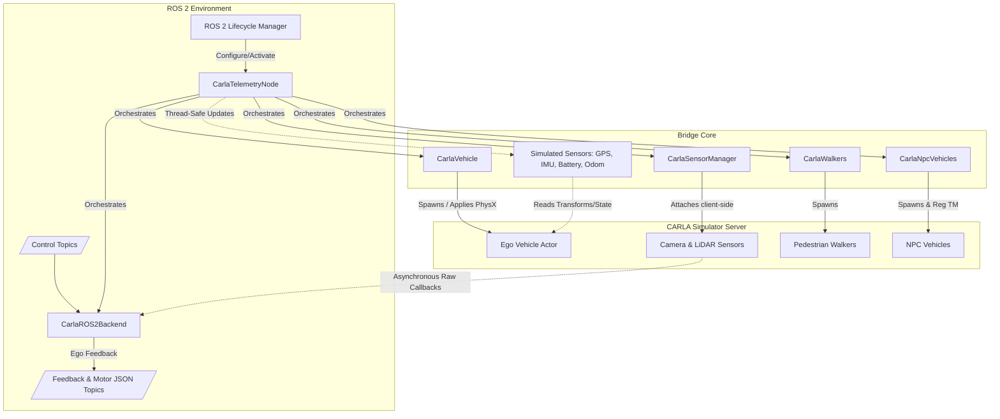
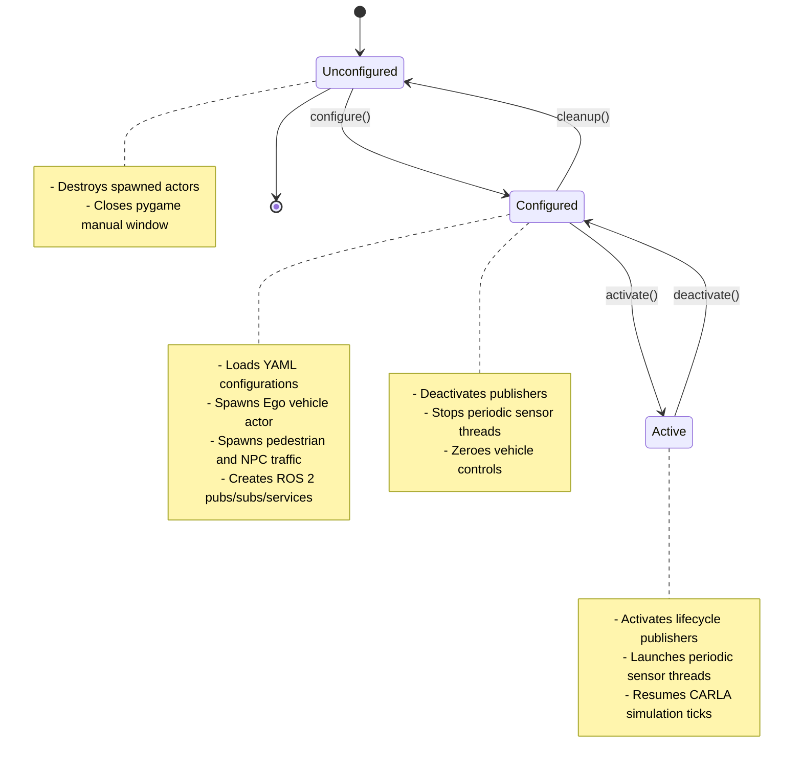

# CARLA Telemetry Interface

The `carla_telemetry` package provides a unified ROS 2 bridge for controlling a CARLA ego vehicle and publishing sensor data (cameras, LiDAR, GPS, IMU, etc.) following the Micropolis ICD standard.

## Running

It can be launched via the provided standard launch file:

```bash
make launch_carla_sim && \
ros2 lifecycle set /micropilot_carla_bridge_node configure && \
ros2 lifecycle set /micropilot_carla_bridge_node activate
```
## Configuration

The node is heavily configured through a YAML file (e.g., `carla_interface_config.yaml`). Below is a summary of the configuration sections:

### 1. `carla`
Configure the connection to the CARLA server.
- `host`, `port`, `timeout`: Connection details.
- `synchronous_mode` and `fixed_delta_seconds`: Enables fixed-step ticks.
- `open_manual_control`: Whether to spawn a pygame-based manual control window.

### 2. `world`
Configure the simulation map.
- `town`: Map name (e.g. `Town01`, `Town10HD`, `Aramco_Map`).
- `spawn_point_index`: Where to spawn the vehicle. `-1` uses a random location.

### 3. `vehicle`
Configure the ego vehicle blueprint and attributes.
- `blueprint`: Ego vehicle blueprint name (e.g., `vehicle.micropolis.upolice_m02p`).
- `role_name`: Used as the ROS actor name (visible in `/carla/<role_name>/...`).
- `generation`: Blueprint version/generation filter ("1", "2", or "All").
- `autopilot`: Enable CARLA Traffic Manager autopilot immediately after spawn.
- `color`: RGB value string (e.g., "255,0,0") or `null` for a random recommended color.
- `transmission`: `manual` or `automatic` gear shift configuration, gear ratios, and limits.
- `drive_mode`: `FWD`, `RWD`, or `AWD`. Uses CARLA tire friction to simulate drive types by lowering unpowered axle friction.
- `physics`: Turn on custom PhysX physics modifications (`mass`, `center_of_mass`, `torque_curve`, `max_rpm`, damping factors, and per-wheel friction/brakes/steering limits).

#### Available Robots BluePrint

|Robot Name|BluePrint Name                   |
|----------|---------------------------------|
|    M2    |`vehicle.micropolis.upolice_m02p`|
|    M1    |`vehicle.micropolis.upolice_m01p`|

### 4. `pedestrians`
Controls the spawning of dynamic walker pedestrians to populate the environment.
- `enabled`: Spawns walkers when set to `true`.
- `count`: The number of walkers to spawn.
- `blueprints`: List of walker types to spawn (randomly distributed).
- `speed`: Maximum walking speed in m/s.

### 5. `npc_vehicles`
Configures surrounding dynamic vehicle traffic managed by CARLA's Traffic Manager.
- `enabled`: Spawns NPC traffic when set to `true`.
- `count`: Number of NPC vehicles to spawn.
- `blueprints`: List of vehicle blueprints to spawn.
- `autopilot`: Toggle autopilot on spawned NPC vehicles.
- `tm_port`: Traffic Manager port (default is `8000`).
- `speed_difference_pct`: Target speed relative to limit (e.g., `20.0` is 20% slower than limit).
- `distance_to_leading_vehicle`: Safe distance gap in meters.
- `auto_lane_change`: Allow automatic lane changes.

### 6. `global_coordinates`
Maps CARLA coordinate origin `(0, 0, 0)` to real-world WGS-84 geographic coordinates.
- `latitude`, `longitude`, `altitude`: Geographic center mapping coords.

### 7. `gps`
Simulates GNSS state and publications.
- `update_rate`: Frequency of navigation satellite fix publisher (Hz).
- `gps_xy_random_walk` / `gps_z_random_walk` / `gps_correlation_time` / `gps_xy_noise_density` / `gps_z_noise_density` / `gps_vxy_noise_density` / `gps_vz_noise_density`: Additive Gauss-Markov and white noise models.
- `spawn_point`: Sensor mounting position offset relative to ego vehicle.
- `noise_alt_stddev` / `noise_lat_stddev` / `noise_lon_stddev`: Extra noise applied via CARLA client attributes.

### 8. `battery`
A simulated software battery model driven by vehicle movement.
- `voltage`, `open_circuit_voltage_constant_coef`, `open_circuit_voltage_linear_coef`: Nominal open-circuit and linear voltage coefficients.
- `capacity`, `initial_charge`, `resistance`, `smooth_current_tau`: Electrical characteristics.
- `power_load`: Base static power draw (W).
- `consumption_mode`: `"constant"` (baseline draw only) or `"velocity_based"` (proportional to vehicle speed).
- `power_per_speed`: Velocity-proportional coefficient (W / (m/s)).
- `start_draining`: Start draining battery immediately on spawn.
- `enable_recharge`: Enable battery recharging services.
- `charging_time`: Hours required to fully charge from 0%.
- `update_rate`: Frequency of battery state updates (Hz).

### 9. `imu`
Configures the IMU sensor.
- `enabled`: Spawn CARLA IMU if `true`.
- `spawn_point`: mounting position offset.
- `noise_accel_stddev_x/y/z` / `noise_gyro_stddev_x/y/z` / `noise_gyro_bias_x/y/z`: Accel and gyro noise profiles.
- `frame_id`: ROS header frame identifier.
- `update_rate`: Publishing rate (Hz).

### 10. `odometry`
Simulates vehicle odometry directly from ground-truth actor transform/velocity.
- `enabled`: Enable odometry tracking if `true`.
- `frame_id`: Parent frame (usually `"odom"`).
- `child_frame_id`: Child frame (usually `"base_link"`).
- `update_rate`: Publication frequency (Hz).
- `broadcast_tf`: Broadcast `odom` -> `base_link` transforms using tf2.

### 11. `tf`
Static transform publishers.
- `broadcast_sensor_tf`: Broadcast static frames mapping from ego vehicle frame to sensor frames.
- `base_frame_id`: Parent frame for static tf tree (defaults to `"base_link"`).

### 12. `cameras`
List of camera objects spawned and attached to the ego vehicle.
- `name`: Unique camera identifier.
- `enabled`: Spawns camera if `true`.
- `type`: CARLA camera sensor type (e.g. `sensor.camera.rgb`, `sensor.camera.depth`).
- `spawn_point`: Mount offset coordinates (`x, y, z, roll, pitch, yaw`).
- `image_size_x`, `image_size_y`: Pixels width/height.
- `fov`: Field of view in degrees.
- `update_rate`: Publishing rate (Hz).
- `frame_id`: Target transform frame.
- `topic_rgb`, `topic_camera_info`: Relative or absolute ROS 2 topics for images and intrinsics.

### 13. `lidars`
List of LiDAR sensors attached to the vehicle.
- `name`: Unique LiDAR identifier.
- `enabled`: Spawns LiDAR if `true`.
- `lidar_type`: `"rotary"` (spinning ray-cast) or `"solid_state"` (ray-cast semantic cone).
- `spawn_point`: Mount offset.
- `channels`: Laser beam count.
- `range`: Max range detection (meters).
- `points_per_second`: Total points count generated per second.
- `rotation_frequency`: Rotating frequency (Hz).
- `upper_fov` / `lower_fov`: Upward/downward scan angle limits.
- `atmosphere_attenuation_rate` / `dropoff_general_rate` / `dropoff_intensity_limit` / `dropoff_zero_intensity`: Realistic noise and dropoff probability (rotary only).
- `horizontal_fov` / `vertical_fov`: Scanning width and height limits (solid_state only).
- `update_rate`, `frame_id`, `topic_point_cloud`: ROS 2 publishing config.

### 14. `control`
Controller scaling and tracking settings.
- `source`: Command receiver source mode. Choice between `"vehicle_interface"` (RPM/steering_angle/brakes) or `"ackermann_drive"` (`ackermann_msgs/AckermannDrive`).
- `speed_pid` / `steer_pid` / `steer_vel_pid` / `rpm_pid`: PID parameters (`kp`, `ki`, `kd`, `max_integral`, `max_output`) for tracking target values.
- `max_rpm`: RPM corresponding to 1.0 full throttle.
- `max_steer_deg`: Steering angle corresponding to 1.0 full steering input.

### 15. `ros2`
Configure custom topics, namespaces, and services.
- `namespace`: Base namespace prepended to relative topics.
- `topics`: Mapping of logical topic names (e.g. `feedback_gps`, `odom`, `control_velocity_rpm`) to actual topic strings.
- `services`: Mapping of logical service names to actual service strings.

---

## ROS 2 Interface

All topic names use an optional custom namespace (e.g., `/sim/`) which is configured via `config.ros2.namespace`. Below reflects the namespace as `<namespace>`.

### Publishers

| Topic | Message Type | Description |
|-------|--------------|-------------|
| `/<namespace>/feedback/gps` | `sensor_msgs/msg/NavSatFix` | GPS location |
| `/<namespace>/feedback/gps_vel` | `geometry_msgs/msg/TwistStamped` | GPS velocity in Map frame |
| `/<namespace>/feedback/battery/state` | `sensor_msgs/msg/BatteryState` | Simulated battery state |
| `/<namespace>/feedback/imu` | `sensor_msgs/msg/Imu` | IMU data (converted to ROS REP-103 frame) |
| `/<namespace>/odom` | `nav_msgs/msg/Odometry` | Ground truth Odometry (with optional TF) |
| `/<namespace>/feedback/speed` | `std_msgs/msg/Float32` | Speed echo in m/s |
| `/<namespace>/feedback/steering_angle` | `std_msgs/msg/Float32` | Echo of actual steering angle in degrees |
| `/<namespace>/feedback/steering_angles` | `sensor_msgs/msg/JointState` | Explicit joint state for all 4 wheels |
| `/<namespace>/<camera_name>/rgb` | `sensor_msgs/msg/Image` | Camera RGB stream |
| `/<namespace>/<camera_name>/camera_info`| `sensor_msgs/msg/CameraInfo` | Camera intrinsics |
| `/<namespace>/lidar/<lidar_name>/points`| `sensor_msgs/msg/PointCloud2` | LiDAR pointcloud |
| `/<namespace>/feedback/motors` | `std_msgs/msg/String` | JSON with speed/torque/brake for all 4 wheels |
| `/<namespace>/feedback/vehicle_state` | `std_msgs/msg/String` | JSON with light, blinker, and steering state |
| `/micropilot_system_manager_node/component_health` | `sim_manager_msgs/msg/ComponentHealth` | Statuses of the simulator node |

#### motor data format

```json
{
  "timestamp": 123456789.0,
  "frame_id": "Motors_Data",
  "front_left": {
    "speed_rpm": 100.0,
    "speed_mps": 2.0,
    "steering_angle_deg": 10.0,
    "steering_angle_rad": 0.1745,
    "steering_angular_velocity": 0.0,
    "steering_angular_velocity_radps": 0.0,
    "brake_percentage": 0.0,
    "power": 100.0,
    "torque": 10.0,
    "drive_motor_error": "OK",
    "steering_motor_error": "OK",
    "brake_motor_error": "OK"
  },
  "front_right": {
    "speed_rpm": 100.0,
    "speed_mps": 2.0,
    "steering_angle_deg": 10.0,
    "steering_angle_rad": 0.1745,
    "steering_angular_velocity": 0.0,
    "steering_angular_velocity_radps": 0.0,
    "brake_percentage": 0.0,
    "power": 100.0,
    "torque": 10.0,
    "drive_motor_error": "OK",
    "steering_motor_error": "OK",
    "brake_motor_error": "OK"
  },
  "back_left": {
    "speed_rpm": 100.0,
    "speed_mps": 2.0,
    "steering_angle_deg": 0.0,
    "steering_angle_rad": 0.0,
    "steering_angular_velocity": 0.0,
    "steering_angular_velocity_radps": 0.0,
    "brake_percentage": 0.0,
    "power": 100.0,
    "torque": 10.0,
    "drive_motor_error": "OK",
    "steering_motor_error": "OK",
    "brake_motor_error": "OK"
  },
  "back_right": {
    "speed_rpm": 100.0,
    "speed_mps": 2.0,
    "steering_angle_deg": 0.0,
    "steering_angle_rad": 0.0,
    "steering_angular_velocity": 0.0,
    "steering_angular_velocity_radps": 0.0,
    "brake_percentage": 0.0,
    "power": 100.0,
    "torque": 10.0,
    "drive_motor_error": "OK",
    "steering_motor_error": "OK",
    "brake_motor_error": "OK"
  }
}
```

#### vehicle state data format

Published on `/<namespace>/feedback/vehicle_state` every tick. `lights` and `blinkers` are decoded from the CARLA `VehicleLightState` bitmask. `steering.mode` is the active steering mode name (`disable`, `front_ackerman`, `double_ackerman`, `crab_steer`, `front_parallel`, `double_parallel`, `go_to_home`, `calibration`) with `mode_id` the matching `carla_msgs/srv/SetSteeringMode` integer constant. `blinkers.hazard` is `true` only when both blinkers are on.

```json
{
  "timestamp": 123456789.0,
  "frame_id": "Vehicle_State",
  "lights": {
    "position": false,
    "low_beam": false,
    "high_beam": false,
    "brake": false,
    "reverse": false,
    "fog": false,
    "interior": false,
    "siren": false,
    "special2": false
  },
  "blinkers": {
    "left": false,
    "right": false,
    "hazard": false
  },
  "steering": {
    "mode": "double_ackerman",
    "mode_id": 2
  }
}
```

### Subscribers

| Topic | Message Type | Description |
|-------|--------------|-------------|
| `/<namespace>/control/velocity_rpm` | `std_msgs/msg/Float32` | Drive motor target RPM (Positive=Forward, Negative=Reverse) |
| `/<namespace>/control/steering_angle_deg`| `std_msgs/msg/Float32` | Commanded steering angle in degrees (+Left / -Right) |
| `/<namespace>/control/brake` | `std_msgs/msg/Bool` | Emergency brake |
| `/<namespace>/control/ackermann_drive` | `ackermann_msgs/msg/AckermannDrive` | Ackermann steering and speed command |
| `/sim/spawn_point` (Absolute) | `geometry_msgs/msg/Pose2D` | Teleports ego vehicle to target X, Y, Theta |
| `/micropolis/sim/start` (Absolute) | `std_msgs/msg/Empty` | Resumes simulation tick |
| `/micropolis/sim/stop` (Absolute) | `std_msgs/msg/Empty` | Pauses simulation tick |

### Services

| Service | Service Type | Description |
|---------|--------------|-------------|
| `/micropolis/sim/start` (Absolute) | `std_srvs/srv/Trigger` | Resume simulation |
| `/micropolis/sim/stop` (Absolute) | `std_srvs/srv/Trigger` | Pause simulation |
| `/<namespace>/control/battery/start_drain` | `std_srvs/srv/Trigger` | Start battery consumption |
| `/<namespace>/control/battery/stop_drain` | `std_srvs/srv/Trigger` | Stop battery consumption |
| `/<namespace>/control/battery/start_charge` | `std_srvs/srv/Trigger` | Start battery recharge |
| `/<namespace>/control/battery/stop_charge` | `std_srvs/srv/Trigger` | Stop battery recharge |
| `/<namespace>/control/lights/high_beams` | `std_srvs/srv/SetBool` | Toggle high beams |
| `/<namespace>/control/lights/low_beams` | `std_srvs/srv/SetBool` | Toggle low beams |
| `/<namespace>/control/lights/left_blinker` | `std_srvs/srv/SetBool` | Toggle left turn signal |
| `/<namespace>/control/lights/right_blinker`| `std_srvs/srv/SetBool` | Toggle right turn signal |
| `/<namespace>/control/lights/siren` | `std_srvs/srv/SetBool` | Toggle special/siren lights |
| `/<namespace>/control/lights/brake_lights` | `std_srvs/srv/SetBool` | Toggle vehicle brake lights |
| `/<namespace>/control/force_manual_control`| `std_srvs/srv/SetBool` | Override ROS 2 control and force pygame manual control |
| `/<namespace>/control/set_steering_mode` | `carla_msgs/srv/SetSteeringMode` | Toggle front, rear, or four-wheel steering modes |

---

## C++ Implementation (`carla_telemetry_cpp`)

The C++ implementation is a high-performance port of the original python bridge. It provides deterministic lifecycle node state transitions, multi-threaded sensor acquisition, and direct integration with CARLA's C++ API.

### Package Structure

The package is structured as a standard ROS 2 C++ package built with `ament_cmake`:

```
src/ros_apps/carla_telemetry_cpp/
├── CMakeLists.txt              # Build configuration (finds rclcpp, carla libraries, yaml-cpp)
├── package.xml                 # Package manifest listing ROS 2 and system dependencies
├── include/
│   └── carla_telemetry/
│       ├── sensors/            # Header files for specific sensors
│       │   ├── battery.hpp
│       │   ├── camera.hpp
│       │   ├── gps.hpp
│       │   ├── imu.hpp
│       │   ├── lidar.hpp
│       │   └── odometry.hpp
│       ├── node.hpp            # CarlaTelemetryNode main lifecycle class
│       ├── npc_vehicles.hpp    # NPC vehicle Traffic Manager manager
│       ├── perf_monitor.hpp    # Frame rate / tick performance monitor helper
│       ├── ros2_backend.hpp    # ROS 2 Publisher, Subscriber, and Service manager
│       ├── sensor_manager.hpp  # High-level camera and LiDAR instantiator
│       ├── types.hpp           # Common state representation structs
│       ├── vehicle.hpp         # Ego vehicle spawn and custom physics wrapper
│       └── walkers.hpp         # Pedestrians spawner and manager
└── src/
    ├── sensors/                # Source code implementations of simulated/attached sensors
    │   ├── battery.cpp         # Software LinearBatteryPlugin model
    │   ├── camera.cpp          # Camera image buffers to ROS Image converter
    │   ├── gps.cpp             # GNSS model with Gauss-Markov noise + WGS-84 reprojection
    │   ├── imu.cpp             # CARLA IMU data parser & frame converter
    │   ├── lidar.cpp           # Rotary/Solid-state raw raycast to PointCloud2 parser
    │   └── odometry.cpp        # Ground-truth odom pose tracker and tf2 broadcaster
    ├── main.cpp                # Node execution entry point (single threaded executor)
    ├── node.cpp                # Lifecycle transition callbacks and sensor threads orchestrator
    ├── npc_vehicles.cpp        # Auto-populates Traffic Manager controlled NPC cars
    ├── perf_monitor.cpp        # Tracks physics execution time vs ROS timer callbacks
    ├── ros2_backend.cpp        # ROS 2 subscriptions, PID loops, motor JSON and lifecycle publishers
    ├── sensor_manager.cpp      # Creates and attaches raw CARLA sensor actors to the vehicle
    ├── vehicle.cpp             # Vehicle spawning, gear shifts, custom wheel/engine physics overrides
    └── walkers.cpp             # Walkers AI controller configurer
```

### Architecture and Core Modules



1. **`CarlaTelemetryNode` (Lifecycle Node)**:
   - Inherits from `rclcpp_lifecycle::LifecycleNode`.
   - Coordinates state changes and holds ownership of the core system modules.
   - Manages background sensor threads (`gps_loop`, `battery_loop`, `imu_loop`, `odom_loop`) which periodically query/update states and publish ROS 2 messages at configured rates.

2. **`CarlaVehicle` (Ego Vehicle Handler)**:
   - Connects to the CARLA client world, retrieves the requested ego vehicle blueprint (e.g. `upolice_m02p`), and spawns the vehicle actor.
   - Modifies physical properties (vehicle mass, moment of inertia, engine torque curves, drag coefficient, steering limits).
   - Simulates drive modes (`FWD`, `RWD`, `AWD`) by adjusting tires friction, and applies automatic/manual gearbox shifts based on speed.

3. **`CarlaROS2Backend` (ROS 2 Interface Layer)**:
   - Registers subscribers for target steering commands, RPM speed controls, emergency brakes, and Ackermann commands.
   - Operates internal PID control loops to convert high-level commands (e.g. target speed in m/s or target steer angle in rad) to low-level CARLA throttle/steer/brake inputs.
   - Periodically compiles and publishes vehicle feedback, including explicit 4-wheel joint states and detailed motor statistics formatted in JSON string messages.

4. **`CarlaSensorManager` (CARLA Sensors Handler)**:
   - Dynamically spawns and registers camera and LiDAR sensors specified in the configuration.
   - Connects CARLA's raw sensor streaming callbacks (client-side thread) to ROS 2 publishers inside `CarlaROS2Backend` to minimize data copy overhead.

### Lifecycle State Machine

The bridge uses standard ROS 2 lifecycle states to manage connection initialization, actor spawning, and thread safety:



- **`on_configure`**:
  - Parses configuration from YAML.
  - Spawns the ego vehicle, walker pedestrians, and traffic NPC vehicles.
  - Instantiates `CarlaROS2Backend` and creates all topic publishers, subscriptions, and services.
  - Instantiates `CarlaSensorManager` to spawn cameras and LiDARs.
- **`on_activate`**:
  - Activates ROS 2 Lifecycle publishers.
  - Sets the CARLA simulator to synchronous tick mode (if configured).
  - Starts thread pools for periodic sensor publication loops (GPS, Battery, IMU, Odometry).
- **`on_deactivate`**:
  - Deactivates publishers.
  - Signals shutdown to all background threads and joins them.
  - Commands the ego vehicle to stop (zero throttle, full brakes).
- **`on_cleanup`**:
  - Destroys all spawned actors from the CARLA world.
  - Resets all internal smart pointers.
- **`on_shutdown`**:
  - Ensures clean shutdown and release of CARLA client connections.

### Build and Run

To compile the workspace and the C++ bridge package:

```bash
make setup_ros2_workspace
```

To download CARLA simulator:

```bash
download_Carla_Assets
```

To run the simulation and launch the bridge node:

```bash
# Launch both the CARLA simulator server and the bridge node
make launch_carla_sim

# Or launch only the bridge node (if the CARLA server is already running)
make launch_carla_sim_no_server
```

By default, the bridge node spawns in the `unconfigured` lifecycle state. You can set `AUTO_START` to `true` to automatically transition the node to the `active` state upon launch:

```bash
make launch_carla_sim AUTO_START=true
```

If `AUTO_START` is set to `false` (the default), transition the node lifecycle states manually using ROS 2 command-line tools:

```bash
# Transition node to Configured state
ros2 lifecycle set /micropilot_carla_bridge_node configure

# Transition node to Active state (starts telemetry stream)
ros2 lifecycle set /micropilot_carla_bridge_node activate
```
