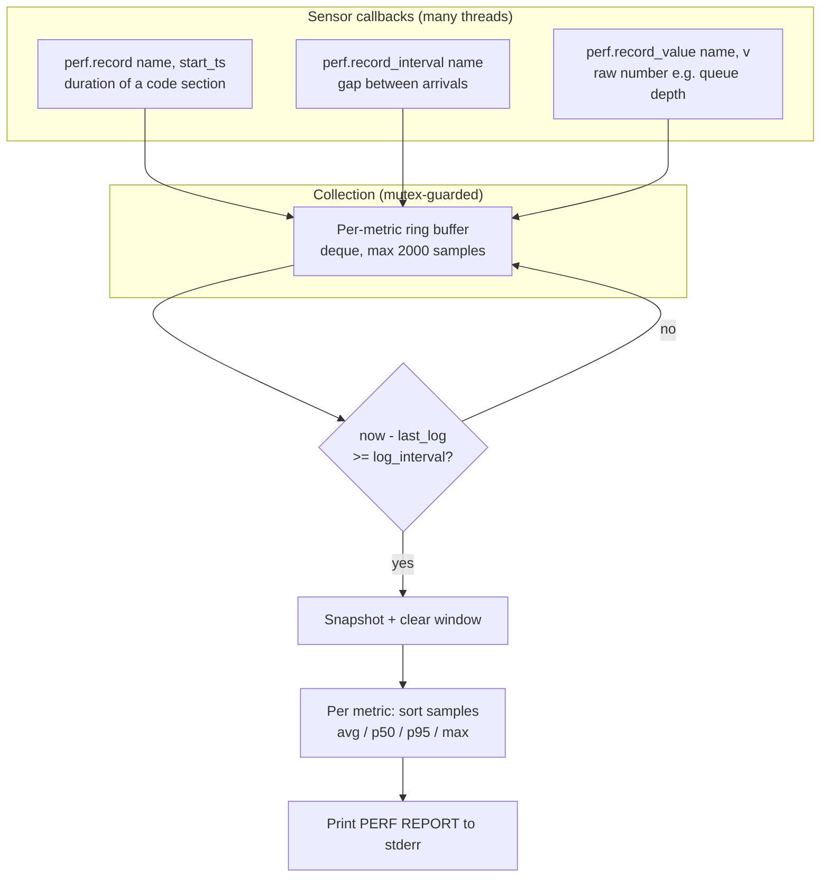

# Performance Monitor

This document explains the pipeline performance instrumentation used by the
`carla_telemetry_cpp` telemetry bridge, and the exact steps it uses to turn raw
timestamps into the `PERF REPORT` you see in the logs.

Source: [`perf_monitor.hpp`](../src/ros_apps/carla_telemetry_cpp/include/carla_telemetry/perf_monitor.hpp)
· [`perf_monitor.cpp`](../src/ros_apps/carla_telemetry_cpp/src/perf_monitor.cpp)

## Overview

`PerfMonitor` is a lightweight, thread-safe timing collector. Sensor callbacks
push samples (durations, intervals, or raw values) into per-metric ring buffers.
Every `log_interval` seconds (default **10s**) it drains those buffers, computes
summary statistics per metric, prints a report, and resets the window.

- **Enable:** `CARLA_PERF=1` environment variable. Unset / `0` / `false` → every
  call is a no-op (near-zero cost).
- **Launch with it on:** `make launch_carla_sim_perf` (sets `CARLA_PERF=1`).
- **Output:** written to `stderr` as a boxed `PERF REPORT`.
- **Singleton:** one global `perf` object shared across all sensors.

## Data Flow



## The three ways a sample is produced

| Call | What it measures | Formula |
|------|------------------|---------|
| `record(name, start)` | Duration of a code section (parse, publish, callback). | `elapsed_ms = (now - start) * 1000` |
| `record_interval(name)` | Time between two arrivals of the same event (inter-arrival). First call only primes the timer. | `dt_ms = (now - last_ts[name]) * 1000` |
| `record_value(name, v)` | An arbitrary number, not a time (e.g. queue depth). | stored as-is |

`tick()` returns the current time from a **monotonic** `steady_clock` (as
seconds). Monotonic is required: a wall-clock (NTP/manual adjustment) can jump
backward and produce negative or huge bogus samples.

## Calculation steps (per report)

Every `log_interval` seconds, `maybe_log()` does this:

1. **Trigger check** — if `now - last_log < log_interval`, return immediately.
   The check is re-tested inside the lock so concurrent threads log only once.
2. **Snapshot + reset** — copy each metric's buffer, then `clear()` the window.
   Each report therefore covers **only the samples since the previous report**,
   not a growing cumulative history. (Without the reset the buffer kept up to
   2000 old samples and the average barely moved report-to-report.)
3. **Per metric**, on the snapshot's samples `v`:
   1. Sort `v` ascending. Let `n = v.size()`.
   2. `avg = sum(v) / n`
   3. `p50 = percentile(v, 50)`  → the median (typical case)
   4. `p95 = percentile(v, 95)`  → tail / jitter: 95% of samples are ≤ this
   5. `max = v[n-1]`  → worst sample in the window
4. **Print** one line per metric, sorted by name, all values in **milliseconds**.

### Nearest-rank percentile

Both p50 and p95 use the same nearest-rank definition:

```
rank = ceil(p / 100 * n)      # clamped to [1, n]
percentile = sorted[rank - 1]
```

Example, `n = 20` samples:
- p50 → `rank = ceil(0.50 * 20) = 10` → 10th smallest
- p95 → `rank = ceil(0.95 * 20) = 19` → 19th smallest

### Deriving server rate from `*.server_dt`

`record_interval` metrics named `*.server_dt` measure how fast the CARLA server
delivers frames to the client (inter-arrival time). Convert the average interval
to a rate:

```
server_Hz ≈ 1000 / avg(server_dt_ms)
```

e.g. `avg = 50 ms` → ~20 Hz.

## Reading a report

```
╔══ PERF REPORT (last 10s) ═══════════════════════════════════╗
║  cols = ms | p50 = median | p95 = 95% of samples ≤ value (tail/jitter)
║  *.server_dt = server → client interval (server Hz ≈ 1000/avg)
║  lidar.parse_lidar.total       n= 200  avg=  3.10  p50=  2.90  p95=  5.40  max= 12.10 ms
╚════════════════════════════════════════════════════════╝
```

- `n` — sample count in this 10s window.
- `avg` — mean; overall cost.
- `p50` — median; the typical case, robust to outliers.
- `p95` / `max` — tail behaviour; a large gap between p50 and p95/max means
  jitter or occasional stalls, not steady slowness.

## Metric catalog

Names come from the sensor call sites (`<name>` is the sensor's ROS frame id).

| Metric | Type | Meaning |
|--------|------|---------|
| `<name>.server_dt` | interval | CARLA → client frame arrival gap (→ server Hz) |
| `<name>.total` | duration | End-to-end age of a frame from server arrival to publish |
| `cam.callback` / `cam.parse` / `cam.ros2_publish` | duration | Camera stages: receive, decode, publish |
| `cam.queue_depth` | value | Camera frame queue backlog |
| `lidar.callback.*` | duration | LiDAR receive path (accumulate, queue push, early exit) |
| `lidar.parse_lidar.*` | duration | LiDAR point-cloud parse (total, cast failures) |
| `lidar.publish_loop.*` | duration | LiDAR publish worker (queue pop, parse, publish) |
| `lidar.queue_depth` | value | LiDAR frame queue backlog |
| `depth_lidar.reproject` | duration | Depth-camera → point-cloud reprojection |
| `depth_lidar.*.server_dt.camN` | interval | Per-camera arrival gap for the depth-lidar rig |
| `telemetry.loop` / `node.timer` | duration | Main node loop / timer callback cost |
| `rpc.GetControl` / `rpc.GetTelemetryData` | duration | Blocking CARLA RPC round-trip (port 2000) for vehicle state |
| `rpc.GetVelocity` / `rpc.GetTransform` | duration | Blocking CARLA RPC round-trip for kinematics |
| `rpc.ApplyControl` | duration | Blocking CARLA RPC to push a control command |
| `rpc.world_tick` | duration | `world.Tick()` round-trip — only populated in synchronous mode |

RPC metrics measure the **command channel** (rpclib on port 2000), which is
separate from the sensor **streaming channel** (measured by `<name>.server_dt`).
Their call rate is the enclosing loop rate (`telemetry.loop` / `node.timer`).

## DDS profiler node

`dds_profiler_node` is a standalone ROS 2 node (same package) that gives a
**consumer-side** view of the bridge's DDS output — the wire layer the in-process
metrics above cannot see. It subscribes to the sensor + feedback topics from the
same `carla_interface_config.yaml` and emits its own boxed `PERF REPORT`.

Run it next to a live bridge on the **same `ROS_DOMAIN_ID`** (fleet: `export
ROS_DOMAIN_ID=<id>` first):

```
make run_dds_profiler
# or: ros2 run carla_telemetry_cpp dds_profiler_node \
#       --ros-args -p config_file:=<abs path to carla_interface_config.yaml>
```

Metrics (`<topic>` is the resolved ROS topic, e.g. `/fm_camera/raw_images`):

| Metric | Type | Meaning |
|--------|------|---------|
| `dds.<topic>.recv_dt` | interval | Subscriber-side inter-arrival gap → received Hz ≈ 1000/avg |
| `dds.<topic>.latency_ms` | value | `header.stamp` → arrival age (end-to-end DDS + pipeline) |

- Subscriptions are **BEST_EFFORT** — compatible with any publisher QoS, so every
  topic is received regardless of its configured reliability.
- **Drop estimate:** compare `recv_dt` Hz against the expected `update_rate` logged
  at startup. BEST_EFFORT depth-limited drops are silent and carry no sequence
  number, so exact per-sample gap detection is out of scope.
- Latency assumes publisher and profiler share the wall clock (true on one host;
  do not enable `use_sim_time` on only one side).
- Cross-check with `ros2 topic hz <topic> --qos-reliability best_effort`.

## Cost & thread-safety

- **Disabled** (`CARLA_PERF` unset): each call short-circuits on the first `if` —
  no locking, no allocation.
- **Enabled:** one mutex guards all buffers; samples are `double` push-backs into
  a bounded deque (max 2000 each), so memory is capped and old samples are
  dropped FIFO.
