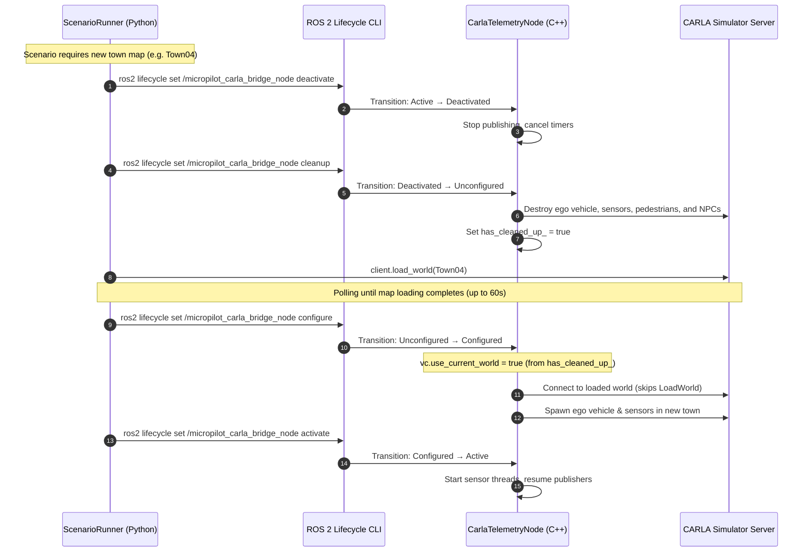

# CARLA Scenario Runner Integration & Design Suite

This document outlines the architecture, tools, and workflows for executing and designing traffic scenarios in CARLA. The suite consists of:
1. **Coordinated Reload Bridge Integration**: ROS 2 Lifecycle coordination between `scenario_runner` and the C++ Telemetry Bridge (`carla_telemetry_cpp`).
2. **Visual Scenario Designer GUI**: A PyQt5-based tool for graphical creation, editing, and deployment of scenarios.
3. **CSV Scenario Batch Executor**: A Python utility to batch run multiple scenarios from a CSV file, logging results and execution time.

---

## 1. Coordinated Reload Architecture

When Scenario Runner requires a map change (e.g., loading a different town for a scenario), it deactivates and cleans up the telemetry bridge, loads the map, and then re-configures and reactivates the bridge. This prevents CARLA server crashes or socket errors caused by active streaming sensors during a reload.

### Lifecycle Sequence Diagram



### Orchestration Details
* **Scenario Runner Side (`scenario_runner.py`)**:
  - Interacts with the bridge lifecycle node (`/micropilot_carla_bridge_node`) via CLI transitions.
  - Deactivates and cleans up actors before map change.
  - Waits for world reload (polls `client.get_world().get_map()` up to 60s).
  - Triggers configuration and activation once the new map is loaded.
* **C++ Telemetry Bridge Side (`node.cpp` & `vehicle.cpp`)**:
  - Tracks `has_cleaned_up_` state.
  - If `use_current_world` is true, binds to the existing world instead of calling `LoadWorld`, avoiding map load conflicts.

---

## 2. Visual Scenario Designer GUI

The Scenario Designer is a PyQt5 visual tool that allows users to graphically design traffic scenarios, position vehicles/pedestrians, configure their paths, select weather parameters, and export runnable ScenarioRunner configurations.

### Directory Structure
```
scenario_runner/tools/scenario_designer/
├── main.py              # Application entrypoint
├── models/              # Data models (project, actors, criteria, weather)
├── gui/                 # PyQt5 UI components (MainWindow, MapCanvas, etc.)
└── generators/          # Export code generators (XML, Python, OpenSCENARIO)
```

### Key Features
* **Map Visualization**:
  - **Online Mode (Recommended)**: Connects to a running CARLA server, loads the OpenDRIVE map, and displays roads, sidewalks, and crosswalks.
  - **Offline Mode**: Manual input of coordinate transforms without map visualization.
* **Actor Placement & Route Editing**:
  - **Ego Vehicle**: Define spawn position, model, and goal coordinates.
  - **NPC Vehicles**: Set spawn transform, model/color, speed limits, intersection stopping behavior, and route waypoints (automatically snapped to driving lanes).
  - **Pedestrians**: Place walking pedestrians with custom speeds, optional wheelchair attributes, and routes (snapped to sidewalks/crosswalks).
* **Keyboard Route Collection (Drive-to-Record)**: Capture an NPC route by *driving* the actor with the keyboard instead of clicking waypoints one by one (see [§2.1](#21-keyboard-route-collection)).
* **Per-Actor Triggers (Multi vs Global)**: Each NPC and pedestrian can be wired to its own trigger point or share the global scenario trigger (see [§2.2](#22-per-actor-triggers-multi-vs-global)).
* **Trigger Points**: Define custom circular trigger regions that activate scenario logic when the ego vehicle enters them.
* **Weather Configuration**: Set cloudiness, precipitation, deposits, wind, sun azimuth/altitude, fog, and wetness.
* **Test Criteria**: Toggle collision-to-fail logic, reach-goal success triggers, and custom execution timeouts.
* **Camera Synchronization**: Automatically syncs the CARLA spectator camera view in real time with the selected designer actor for visual validation.
* **Scenario Export**: Generates and optionally deploys files directly to:
  - **XML Configuration**: Saved to `srunner/examples/` for ScenarioRunner parameters.
  - **Python Behavior Code**: Behavior Trees generated under `srunner/scenarios/` utilizing `py_trees` (incorporating `WaypointFollower`, `StopVehicle`, `InTriggerDistanceToLocation`, etc.).
  - **OpenSCENARIO 1.0**: `.xosc` files generated under `srunner/examples/` for standards-compliant simulation.
  - **Project Save**: `.scenario.json` to preserve design history.

### 2.1 Keyboard Route Collection

Drawing an NPC route click-by-click is tedious for long paths. **Collect mode** lets you "drive" the selected NPC around the map with the keyboard; the tool samples waypoints automatically as the actor moves and draws the route live.

**Start collecting** (any of):
- Select an NPC, then click the toolbar toggle **🎯 Collect Waypoints**.
- Right-click an NPC marker on the canvas → collect.
- Right-click the NPC in the object tree → collect waypoints.

**While collecting** — focus is on the map canvas:

| Key | Action |
|-----|--------|
| **↑ / ↓** | Drive forward / backward `1.0 m` along current heading |
| **← / →** | Steer `5.0°` left / right |
| **Space** | Toggle lane-snap: `ON` snaps to nearest driving lane, `OFF` = free placement |
| **Esc** | Stop collecting |

**Stop collecting** (any of):
- Press **Esc**.
- Re-click the toolbar toggle (label flips to **⏹ Stop Collecting** while active).
- Click **⏹ Stop Collecting** on the NPC properties panel.

**Sampling**: a waypoint is recorded only after the actor moves at least the *sample distance* (default `2.0 m`, adjustable in the properties panel via the spacing field). This avoids dense duplicate points. Lower it for tight curves, raise it for long straights.

**Notes**:
- In collect mode the vehicle yaw is fixed by your steering (no auto-snap of heading) so the recorded heading matches how you drove.
- Live route segments + nodes draw incrementally during the drag; `refresh_markers` clears the live overlay and redraws from project data when collection ends.

### 2.2 Per-Actor Triggers (Multi vs Global)

Previously a scenario had a single shared trigger. Now **every NPC and pedestrian** carries an optional `trigger_uid`:

- **`None` → Global**: the actor starts when the shared scenario trigger fires (ego reaches the scenario start / single trigger point).
- **`<TriggerPoint.uid>` → Per-actor**: the actor's behavior `Sequence` is gated by its own `InTriggerDistanceToLocation` guard — it only begins once the ego reaches *that specific* trigger point.

**Assign in the GUI**: select an NPC/pedestrian → properties panel → **Trigger** dropdown. `Global (scenario trigger)` is the default; any defined trigger point appears by name. The selector list refreshes on selection/move via `set_triggers(project.trigger_points)`.

**Persisted**: `trigger_uid` is saved in the `.scenario.json` for both `NPCVehicle` and `Pedestrian`.

**Generated behavior** (`generators/python_generator.py`):
- Per-actor trigger → `InTriggerDistanceToLocation(...)` prepended to that actor's `npc_seq_<i>` / `ped_seq_<i>` Sequence.
- Global actors → start with the shared tree, no extra guard.
- Multiple top-level trigger points → `_setup_scenario_trigger` builds a `py_trees` `Parallel` of `InTriggerDistanceToLocation` guards; a single point returns one guard directly.

This allows **staged scenarios**: e.g. NPC A cuts in when ego reaches trigger 1, pedestrian B crosses when ego reaches trigger 2 — all in one scenario, each actor firing independently.

### Scenario Export (auto-deploy)

On **Export Scenario** with auto-deploy enabled, scenario files now write **straight to their `srunner` destinations** (no duplicate copy in the chosen export dir):
- `<Name>.xml`, `<Name>.xosc` → `srunner/examples/`
- `<name>.py` (lowercased, spaces → `_`) → `srunner/scenarios/`
- `<Name>.scenario.json` → always stays in the chosen export dir.

Destination root honors the `SCENARIO_RUNNER_ROOT` env var if set and valid, else falls back to a path relative to the designer module.

### Running the Designer
Execute the main script from the `scenario_runner` root directory:
```bash
# Run online (connected to CARLA server)
python3 -m tools.scenario_designer.main --host localhost --port 2000

# Run offline (design without a running simulator)
python3 -m tools.scenario_designer.main --offline
```

---

## 3. CSV Scenario Batch Executor

The CSV Scenario Executor is a command-line tool (`run_csv_scenarios.py`) designed to run multiple scenarios in batch mode and log execution statuses.

### How It Works
1. Scans `srunner/examples/` for XML scenarios (by searching for matching `<scenario>` tags) and OpenSCENARIO files (using `FileHeader` descriptions).
2. Reads the input CSV containing scenario names.
3. Sequentially executes each scenario using `scenario_runner.py` with standard flags: `--waitForEgo` and `--reloadWorld`.
4. Parses scenario stdout/stderr and exit codes to classify results into:
   - `PASS`: Scenario executed successfully and passed all criteria.
   - `Failed`: Evaluation criteria failed or runtime error occurred.
   - `Time Out`: Execution exceeded the maximum duration limit.
   - `Not Found`: Scenario name could not be mapped to any local file.
5. Logs duration (in seconds) for pass/fail runs.
6. Progress is saved iteratively after each run, preventing data loss in the event of a simulator crash or user cancellation.

### Running the Batch Executor
```bash
python3 run_csv_scenarios.py --csv test_scenarios.csv --host localhost --port 2000
#or using make file
make run_csv_scenarios
```
*Note: Any additional arguments passed to `run_csv_scenarios.py` (like `--host`, `--port`) are forwarded directly to `scenario_runner.py`.*

### CSV File Format
The input CSV must contain at least a `Scenario Name` column. The runner automatically updates or adds `Status` and `Duration (s)` columns.

Example:
```csv
Scenario Name,Status,Duration (s)
FollowLeadingVehicle_1,PASS,45.20
NonExistentScenario,Not Found,N/A
```

### ROS 2 Bag Recording

For each scenario that actually runs, the batch executor records the ego's sensor + telemetry topics into a ROS 2 bag, so failures can be replayed offline.

- **When**: recording starts only once the scenario is fully loaded and ticking (it polls the scenario manager for the running state), and stops when the run ends.
- **Keep policy**: on `PASS` the bag is **deleted** (nothing to debug); on `Failed` / `Time Out` it is **kept**.
- **Location / name**: `scenarios_bags/<scenario_name>_<YYYYmmdd_HHMMSS>/` (under `micropilot_sim/`, the parent of `scenario_runner/`).
- **Format**: `mcap` by default — indexed, low write-overhead, fewer dropped frames under heavy camera + LiDAR load. Recording uses the native `rosbag2_py.Recorder` API (no `ros2 bag record` subprocess).

**What is recorded** is chosen in [`config/scenario_recording_config.yaml`](../config/scenario_recording_config.yaml) by group toggles (cameras, lidars, odom, gps, battery). Topic **names are never hardcoded** — they are resolved from [`config/carla_interface_config.yaml`](../config/carla_interface_config.yaml), applying the `ros2.namespace` rule (values starting with `/` are absolute; relative values get `/<namespace>/` prepended). Only sensors marked `enabled: true` in the CARLA config are recorded.

**Flags**:
- `--recording-config PATH` — recording config (default `../config/scenario_recording_config.yaml`).
- `--carla-config PATH` — CARLA interface config used to resolve topic names (default `../config/carla_interface_config.yaml`).
- `--no-record` — disable recording entirely.

**Prerequisite**: the process must be launched with **both** ROS 2 and the CARLA/srunner environment sourced (so `rosbag2_py` and `carla` both import), and the `carla_telemetry` node must be running and publishing the topics during the scenario.

---

## 4. End-to-End Workflow Examples

### Visual Scenario Design to Execution Workflow
1. Start CARLA simulator server.
2. Launch the Scenario Designer GUI:
   ```bash
   python3 -m tools.scenario_designer.main --host localhost --port 2000
   ```
3. Load map (e.g. `Town01`), place ego, and design a custom vehicle behavior/route.
4. Click **Export Scenario**. Choose to auto-deploy files.
5. In another terminal, ensure the telemetry bridge is configured/active or running.
6. Run the newly exported scenario:
   ```bash
   python3 scenario_runner.py --scenario <YourScenarioName>_1 --reloadWorld --waitForEgo
   ```

### Batch Execution Workflow
1. Prepare a list of scenarios in `test_scenarios.csv`.
2. Start the telemetry bridge.
3. Run the batch script:
   ```bash
   python3 run_csv_scenarios.py --csv test_scenarios.csv
   ```
4. Inspect the updated CSV file for detailed status results and execution times.
