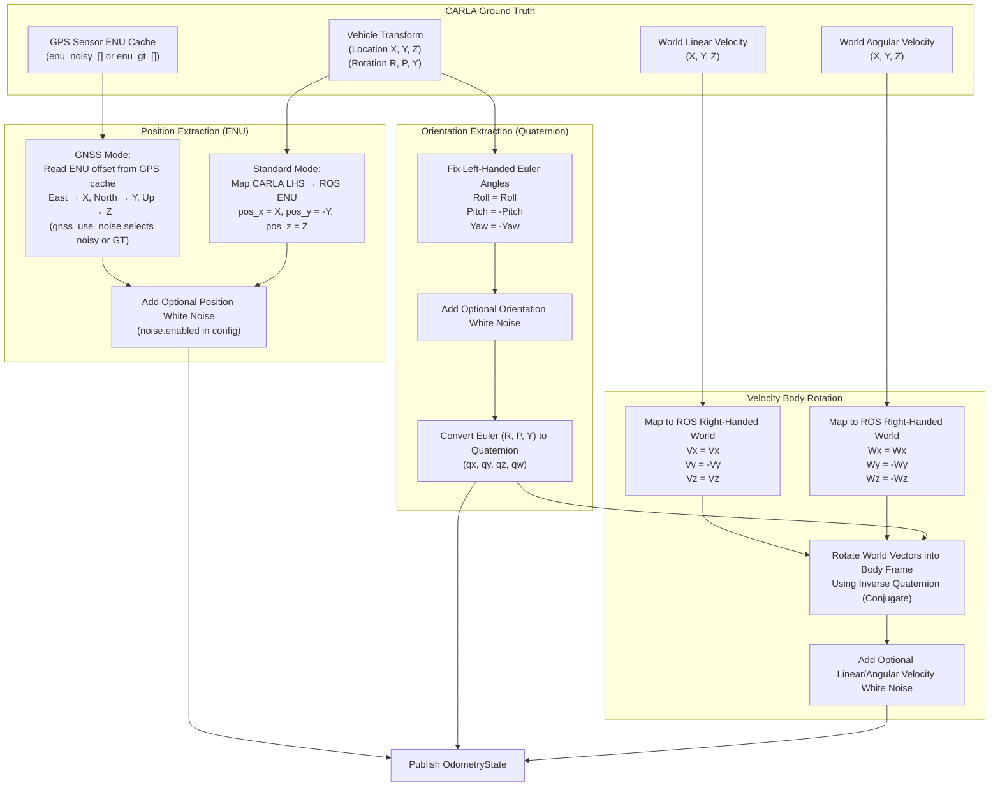

# Odometry Calculation Pipeline

This document explains the data flow for extracting spatial awareness (Odometry) from the CARLA Simulator and mapping it to ROS standard `nav_msgs/Odometry` conventions, including coordinate transformations and body-frame rotations.

## Overview

Odometry bridges the coordinate frame disparity between CARLA (Unreal Engine's Left-Handed System) and the Robot Operating System (ROS, typically a Right-Handed System like ENU). It also rotates global velocity vectors into the vehicle's local body frame.

Two position modes are supported, selectable via the `mode` key in `carla_interface_config.yaml`:

| Mode | Source | Frame |
|---|---|---|
| `standard` | CARLA actor transform (direct) | CARLA LHS → ROS ENU (Y flip) |
| `gnss` | GPS sensor ENU cache | ENU (East=X, North=Y, Up=Z), no flip needed |

When `mode: gnss`, the `gnss_use_noise` key selects the signal quality:

| `gnss_use_noise` | Position source | Use case |
|---|---|---|
| `true` (default) | Noisy ENU (Gauss-Markov bias + white noise) | Realistic autopilot simulation |
| `false` | Ground-truth ENU (perfect CARLA GNSS reprojected) | Reference / debugging |

## Transformation Flow



## Step-by-Step Details

1. **Position Acquisition**:
   - **With GNSS** (`mode: gnss`): Position is sourced directly from the GPS sensor's cached ENU vector — the same ENU frame already computed internally by `gps.cpp` via the ECEF pipeline. This avoids a redundant coordinate-system conversion and is fully consistent with the GPS sensor's published output.
     - `gnss_use_noise: true` → consumes the noisy ENU vector (Gauss-Markov bias + white noise), matching exactly the lat/lon published on `/feedback/gps`.
     - `gnss_use_noise: false` → consumes the ground-truth ENU vector (perfect CARLA GNSS reprojected through the user's origin), useful for debugging or as a reference trace.
   - **Without GNSS** (`mode: standard`): Operates on the CARLA actor's Cartesian transform. Since CARLA uses a Left-Handed coordinate system where Y points South/Right, Y is negated (`pos_y = -loc.y`) to convert to the Right-Handed ROS ENU frame.
2. **ENU Frame Alignment**: In `gnss` mode the ENU axes (East=X, North=Y, Up=Z) map directly onto the ROS ENU convention. **No axis flip is required**, unlike the standard mode.
3. **Orientation Fix**: CARLA's raw Roll, Pitch, and Yaw angles are adjusted for Right-Handed compatibility. Because the Y and Z axes define a handedness flip, pitch (rotation around Y) and yaw (rotation around Z) are negated.
4. **Quaternion Conversion**: Using standard intrinsic $Z$-$Y$-$X$ sequential rotations, the rectified Euler angles are compiled into a normalized orientation Quaternion.
5. **Angular Velocity Handedness Check**: Similar to the Euler angles, angular rotation velocities about the Y and Z axes natively report left-handed positive rotations. These are negated to maintain right-handedness in the ROS world frame.
6. **Inverse Quaternion Rotation (Body Frame Conversion)**: The ROS standard dictates that Twist messages define Linear and Angular velocities in the **child_frame_id (Body Frame)**, whereas CARLA yields velocities in the global **World Frame**. We apply quaternion vector rotation utilizing the conjugate (inverse) of the vehicle's orientation quaternion to geometrically rotate these velocity vectors from the World Frame into the Body Frame.
7. **Noise Emulation**: Uncorrelated zero-mean Gaussian white noise is optionally injected across position, orientation, linear velocity, and angular velocity vectors (controlled by `noise.enabled` in the config). In `gnss` mode with `gnss_use_noise: true`, the position noise from the GPS Gauss-Markov model is already embedded in the ENU vector; the odometry `noise.pos_stddev_*` parameters add an independent secondary layer on top if desired.

---

## ENU vs UTM: Why ENU Is Used for GNSS Mode

The previous GNSS mode implementation projected GPS coordinates into **UTM (Universal Transverse Mercator)** grid coordinates and computed a position offset from the launch origin. This was replaced with the **ENU (East-North-Up via ECEF)** pipeline already used internally by `gps.cpp`. This section documents why.

### Projection Properties

| Property | ENU (via ECEF) | UTM |
|---|---|---|
| **Scale factor** | Exactly **1.0** — true arc distance on the ellipsoid | **k₀ = 0.9996** at the central meridian; varies across the zone |
| **Distortion** | None (tangent-plane approximation, exact at origin) | 0.04 % to ~0.10 % depending on distance from the central meridian |
| **Axis alignment** | East and North are **exactly orthogonal** at the origin | Grid North diverges from True North off the central meridian (convergence angle) |
| **Zone boundaries** | **None** — continuous across all longitudes | Earth divided into 60 × 6° zones; positions near a boundary can jump by ~1 km |
| **Polar validity** | Works globally, including poles | Undefined above 84 °N / 80 °S |
| **Special cases** | None | Norway (zone 32/33 exception at 56–64 °N) and Svalbard (zones 31–37 at 72–84 °N) |

### Numerical Error from UTM Scale Factor

Because UTM shrinks distances by the scale factor, the grid offset differs from the true Earth distance. For a vehicle driving a straight line from the configured `global_coordinates` origin:

| True distance from origin | UTM grid distance | Error |
|---|---|---|
| 10 m | ≈ 9.996 m | ~4 mm |
| 100 m | ≈ 99.96 m | ~4 cm |
| 500 m | ≈ 499.8 m | ~20 cm |
| 1 km | ≈ 999.6 m | ~40 cm |
| 5 km | ≈ 4.998 km | ~2 m |
| 10 km | ≈ 9.996 km | ~4 m |

> [!NOTE]
> The error above is only from the constant `k₀ = 0.9996` factor. Additional distortion arises from the position within the zone (distance from the central meridian), which can push the effective scale factor above 1.0 at zone edges (~1.0010), further widening the gap.

### Why ENU Has No Zone Issue

ENU is computed via the **ECEF (Earth-Centered, Earth-Fixed)** intermediate frame:

```
Geodetic (lat, lon, alt)
    ↓  geodetic_to_ecef()    — WGS-84 ellipsoid equations, global, no zones
ECEF (X, Y, Z)
    ↓  ecef_to_enu()         — 3×3 rotation matrix anchored at the origin point
ENU (East, North, Up) metres
```

The rotation matrix depends only on the **origin's latitude and longitude** — there are no zone boundaries, no scale factor, and no special-case handling required anywhere. The output is in true metres on the WGS-84 ellipsoid surface.

### Consistency with the GPS Sensor

`gps.cpp` already computes ENU internally to apply its Gauss-Markov noise model, then reprojects back to lat/lon for the published GPS message. By caching the intermediate `enu_noisy_[]` and `enu_gt_[]` arrays and exposing them via `get_latest_enu()`, the odometry node reads the **same vector** that was used to produce the published GPS fix — with zero additional conversion error and no risk of a different pipeline producing subtly inconsistent results.
